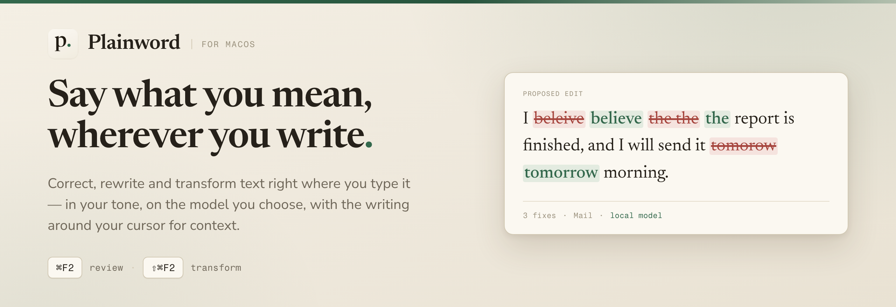
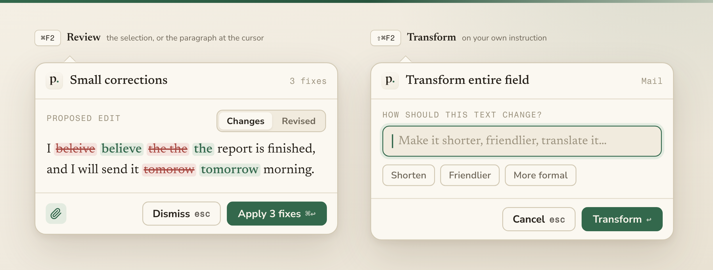

<div align="center">
  
</div>

Plainword is a macOS menu-bar writing assistant. It corrects, rewrites and transforms text
in the app you are already writing in — text fields, browsers, Slack, Mail — and runs on the
AI provider of your choice: a local Ollama model, your Codex login, or any OpenAI-compatible
endpoint. There is no Plainword subscription.

<div align="center">
  
</div>

- **`⌘F2` — review.** Works on the selection, or the paragraph at the cursor. Small fixes are
  marked inline; larger rewrites arrive as a comparison you accept or dismiss.
- **`⇧⌘F2` — transform.** Give your own instruction — *shorter*, *less formal*,
  *keep the second sentence* — on the selection, or the whole focused field.
- **In your voice.** A tone, a style and standing instructions ("British English, no
  semicolons") ride along with every request, together with the writing around your cursor,
  so a reply in a thread is edited as a reply.

### Quiet by default

Plainword stays inert while you type. Every request starts with a keystroke from you, nothing
is applied without your confirmation, and secure fields are ignored. No clipboard access, no
screen capture, any app can be excluded. Credentials live in the Keychain; with Ollama your
text never leaves the Mac.

> [!NOTE]
> Early project. Each app exposes its text differently — where Plainword cannot read a field
> safely, it leaves it alone.

### Install

Unsigned universal DMG previews are on [GitHub Releases](../../releases).

<details>
<summary>Opening an unsigned build</summary>

Only override Gatekeeper for a DMG you downloaded from this repository and trust.

1. Download the DMG and its `.sha256` from the same release, and optionally verify it with
   `shasum -a 256 ~/Downloads/Plainword-*-unsigned.dmg`.
2. Open the DMG, drag **Plainword** into **Applications**, then try to open it. macOS blocks
   it; dismiss the warning.
3. In **System Settings → Privacy & Security → Security**, click **Open Anyway** (available
   for about an hour after the blocked launch), authenticate, and confirm.

macOS then remembers that copy. Grant Accessibility access when the app asks. See
[Apple's instructions](https://support.apple.com/guide/mac-help/mh40616/mac).
</details>

### Build it yourself

macOS 14+, current Xcode, and [XcodeGen](https://github.com/yonaskolb/XcodeGen):

```sh
brew install xcodegen
make run
```

Then pick a provider (for Codex, run `codex login` once), choose a tone under **Writing**,
grant Accessibility access under **General**, and press `⌘F2` in another app.

<details>
<summary>Contributing</summary>

```sh
make project           # Regenerate the Xcode project (project.yml is the source of truth)
make test-core         # Run core tests
make build             # Build the macOS app
make verify            # Run tests and a full build
make signing-status    # Show which identity builds are signed with
make signing-identity  # Create a stable local signing identity (once)
```

**Sign local builds once.** macOS records Accessibility and Keychain approval against an app's
code signature. With no identity on the machine Xcode signs ad-hoc — a signature derived from
the binary, so it changes on every build and both approvals are revoked each time. Give the
build any stable identity and they persist: either add an Apple ID under **Xcode → Settings →
Accounts → Manage Certificates → + → Apple Development** (free accounts work), or run
`make signing-identity` for a self-signed `Plainword Local Dev` certificate. `make build`
reports which it used. After switching, run `make reset-accessibility` once and approve
Plainword one final time.

The interface follows the **Plainword Ink** design system — paper surfaces, ink-green accent,
serif for prose, mono for machinery. Tokens live in
[`DesignSystem.swift`](Sources/PlainwordApp/DesignSystem.swift); the README artwork is
generated from [`docs/design`](docs/design).
</details>
