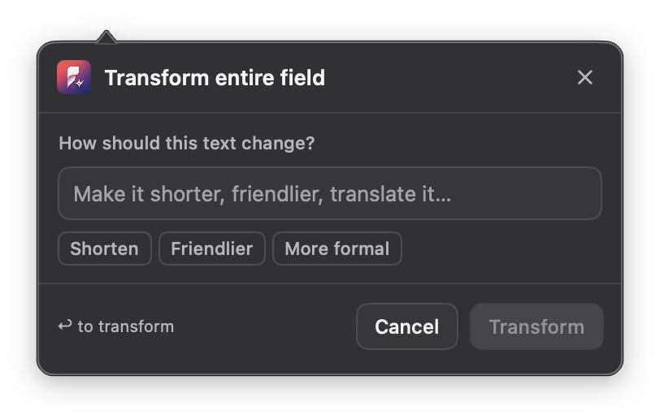

<div align="center">
  
  <h1>Plainword</h1>
  <p><strong>Say what you mean, wherever you write.</strong></p>
  <p>A private, on-demand writing companion for macOS.</p>
</div>

Plainword helps you improve a message, document, or post without pulling you out of the app you are already using. Select the words you want help with—or simply place your cursor in a paragraph—then press **Command–F2**. Plainword suggests a focused improvement and waits for your approval before changing anything. Press **Shift–Command–F2** to open transform mode directly for the selection or whole focused field.

## Better writing, without breaking your flow

- **Write in your own apps.** Get help in supported macOS text fields instead of moving text into a separate editor.
- **Stay in control.** Plainword works only when you ask and shows every suggestion before it is applied.
- **Keep your voice.** Fix grammar and awkward phrasing, improve clarity, shorten text, adjust tone, or translate without turning your writing into generic AI copy.
- **Choose how your text is processed.** Run a model locally with Ollama, use your signed-in Codex subscription, or connect an OpenAI-compatible provider you trust.

## Two shortcuts, one writing flow

1. **Choose the text.** Select a phrase or leave the cursor inside a paragraph.
2. **Press Command–F2.** Plainword reviews only that selection or paragraph.
3. **Review and accept.** See the proposed change beside your writing, then apply or dismiss it.

Need a different kind of edit? Use the wand action to shorten the text, change its tone, translate it, and more. You can also save your preferred tone and writing style so suggestions feel consistent.

To skip the review and give Plainword an edit instruction immediately, press **Shift–Command–F2**. It transforms the exact selection when one exists and otherwise targets the whole focused field without changing the visible selection.

<div align="center">
  
  <p><em>The transform shortcut opens the instruction prompt immediately; no provider request starts until you submit it.</em></p>
</div>

## Private by design

Plainword stays quiet while you type. Typing and selecting text alone never opens the interface or contacts your chosen provider.

- Every review starts with an action from you.
- Suggestions are never applied automatically.
- Password and protected fields are ignored.
- Plainword does not use your clipboard or capture your screen.
- Apps can be excluded at any time.
- Provider credentials are stored securely in the macOS Keychain. Codex reuses the Codex CLI login instead of storing another credential.
- With Ollama, your writing can be processed entirely on your Mac.

## Built for the way you write

Plainword understands selected text, the surrounding paragraph, and nearby context exposed by macOS. It can mark small corrections directly in the source and show larger rewrites in a compact comparison card. If an app cannot safely expose editable text, Plainword leaves it alone.

> [!NOTE]
> Plainword is currently an early macOS project. Compatibility varies because each app exposes its text fields differently.

## Download the preview

Unsigned universal DMG preview builds are available from [GitHub Releases](../../releases). They run on Apple Silicon and Intel Macs.

### Opening the unsigned preview

Only override Gatekeeper if you downloaded the DMG from this repository and trust the release. An unsigned app has not been checked by Apple.

1. Download the DMG and its `.sha256` file from the same GitHub release.
2. Optionally verify the download in Terminal with `shasum -a 256 ~/Downloads/Plainword-*-unsigned.dmg`, then compare the result with the downloaded `.sha256` file.
3. Open the DMG and drag **Plainword** into **Applications**.
4. Try to open Plainword from Applications. macOS will block it; dismiss the warning.
5. Open **System Settings → Privacy & Security** and scroll down to **Security**.
6. Click **Open Anyway** next to the message about Plainword. This option is available for about one hour after the blocked launch attempt.
7. Authenticate when prompted, then confirm by clicking **Open**.

macOS saves an exception for that copy of Plainword. You still need to grant Plainword Accessibility access when the app requests it. See [Apple's instructions for opening an app from an unidentified developer](https://support.apple.com/guide/mac-help/mh40616/mac).

## Try Plainword

You will need macOS 14 or newer, the current stable Xcode, and [XcodeGen](https://github.com/yonaskolb/XcodeGen). You will also need [Ollama](https://ollama.com/) for local processing, a signed-in [Codex CLI](https://learn.chatgpt.com/docs/codex/cli) account, or access to an OpenAI-compatible provider.

```sh
brew install xcodegen
make run
```

When Plainword opens:

1. Under **Provider**, choose **Ollama**, **Codex**, or add an OpenAI-compatible service. For Codex, run `codex login` once in Terminal and sign in with ChatGPT.
2. Pick a tone and style under **Writing**.
3. Under **General**, choose **Allow Access** and enable Plainword in macOS System Settings.
4. Focus a supported text field in another app and press **Command–F2**.

## For contributors

```sh
make project     # Regenerate the Xcode project
make test-core   # Run core tests
make build       # Build the macOS app
make verify      # Run tests and a full build
```

`project.yml` is the source of truth for the generated Xcode project. Local builds do not require an Apple Developer team, although macOS may ask you to grant Accessibility access again after an unsigned rebuild.

For more detail, see the [architecture and security notes](docs/ARCHITECTURE.md), [Codex provider guide](docs/CODEX.md), [provider compatibility guide](docs/CHAT_COMPLETIONS.md), and [release checklist](docs/RELEASE_CHECKLIST.md).
